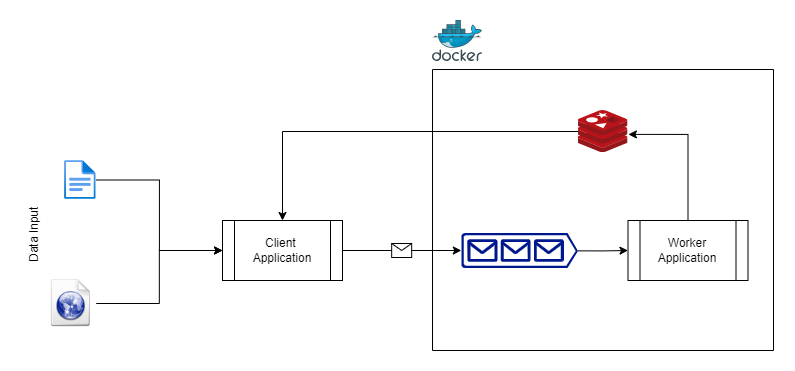

# Text Analyzer

Simple text analyzer which performs the following analisys:

1. Counts the number of spaces in a text;
2. Counts the number of words in a text;
3. Counts the number of letters in a text;
4. Counts the occurrences for each words, and return a list of all the words which have more than 10 occurrences;

## Configuration and usage

For running the overall system you will need [Node JS](https://nodejs.org/en/download) and [Docker](https://www.docker.com/products/docker-desktop/).

### System Infrastructure and architecture

The requirements are so simple that all this infrastructure could have been avoided, but for the sake of system design
(and for my test, of course :smirk:), I have created the infrastructure as the following image:



- Client application => entry point of the system, user will run this application that take the text source as input;
- Message Queue => queue implemented with Rabbi MQ, decupling client application and worker process;
- Worker process => receive text line by line on each message from the queue, perform text operation and counts;
- Redis cache => store data and it's also part of logics, since performs counter increment operation. Keeps track also of all the occurrences of each word with a Sorted Set;

### Third part services and system setup

For setting up a local environment with all the infrastructure you will need to use docker compose.
With a terminal, from the root project execute:

```bash
# install locally all the necessary dependency
npm install

## start the local env with all the required services
docker compose up --build -d
```

The command will create all the needed container with the following services:

- `rabbitmq` - it's a required service;
- `redis` - it's a required service;
- `redis-commander` - it's an optional service, used as a GUI for debug to read/interact Redis database;
- `worker` - background worker application, compiled from `/packages/worker`. it's a required service;

After that, proceed to build everything, you can use [Lerna](https://lerna.js.org/docs/introduction):

```bash
# Build common library and all the applications on the repo
lerna run build
```

And, if everything is fine, you can launch the client application with the following command from the
root repository directory:

```bash
npm run start:client -- < You INPUT GOES THERE >
```

You can use one test file in the repository:

```bash
# Simple test file
npm run start:client -- ../../test-data/test-1.txt

# Short lorem ipsum text
npm run start:client -- ../../test-data/lorem-ipsum-short.txt

# Long lorem ipsum text
npm run start:client -- ../../test-data/lorem-ipsum-long.txt

# Download text from web page
npm run start:client -- https://app.natourwine.org/policy/
```
